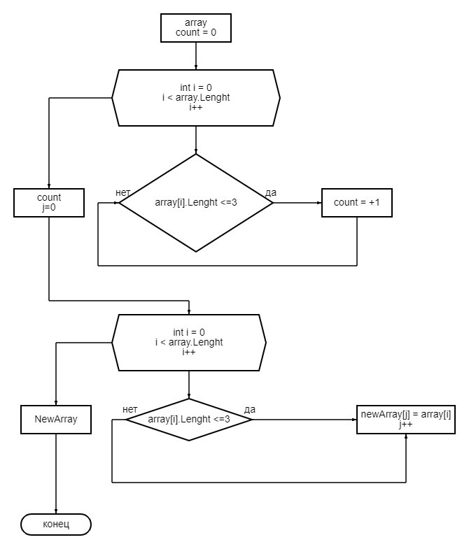

Задача: Написать программу, которая из меющего  массива строк формируем массив из строк, длина которых меньше либо равна 3 симвоволам. Первоначальный массив можно ввесли с клавиатуры, либо задать на старте выполнения алгоритма.

Решение:

1. Задаем на старте массив для анализа.
2. Определяем длину с заданным параметром длины строк.
3. Тернарным оператором перебираем массив по заданным параметрам (<=3).
4. Вывод результата.

